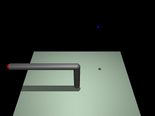
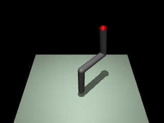

# Robotics learning

This is a quite messy repo with a bunch of code snippets and notebooks related to tracking my progress in robotics and RL.

# Projects

Currently contains two small little projects outlined below

## Quadrotor Control

Altitude control of a quadrotor in Mujoco.

- `/rl/quadrotor_control/lqr.py` - Main LQR code (yes optimal control is kind of RL)
- `/rl/quadrotor_control/control.ipynb` - Simulation and control results

[Twitter post](https://x.com/Jernstrom_dev/status/1856242441575190693)
[Blog post](https://wobbly-speedboat-461.notion.site/LQR-control-of-quadrotor-altitude-13c2c74e93b280cbbe5af3aa7c07590f)

## "Robot" arm

An exetremely simple two joint robot arm simulated in Mujoco. Uses a custom built inverse kinematics solver (uses optimization) to move the arm to a certain target. Implemented in Jax and MJX. Kind of works but still a bit janky and could be made much more dynamic. E.g relies on hand calculating Jacobian which could be done using rotation matrices (on the roadmap). Can be found in `/rl/robotarm` with the following files:

- `/rl/robotarm/mjx.ipynb` - Notebook responsible for running the simulation in Mujoco
- `/rl/robotarm/robot_arm.xml`- Mujoco XML file describing the robot arm
- `/rl/robotarm/lib.py` - Various functions related to the inverse kinematics of the arm

A little demo of how it works (hardcoded version without inverse kinematics): [Twitter post](https://x.com/Jernstrom_dev/status/1822298180676948061)

### Update - version 17th july 2025

Trajectory generation with 5th degree polynomials are now working, yielding a much smoother path.

- `/rl/robotarm/robot_control.ipynb` - Same as below however now it does generation of trajecotory before hand
- `/rl/robotarm/trajectory` - Class with code for generating a trajectory with 5th degree polynomials.

### Update - version 15th july 2025

Basic position control with PD working.

- `/rl/robotarm/robot_control.ipynb` - Main notebook for robot control using builting position modules from mujoco
  Control is done by applying PD on the difference between each current joint position and the calculated desired joint position from the inverse kinematics.

Next step is to generate a smooth trajectory for the robot arm to follow.

### Update - version 25th december 2024

An updated version of the IK(inverse kinematics) solver using a 3dof robot arm. Actually works now. (Big shoutout to Alexis Fraudita's [blog](https://alefram.github.io/posts/Basic-inverse-kinematics-in-Mujoco) which covers IK in mujoco really well.)The new one consists of these files:

- `/rl/robotarm/ik.py` - Inverse kinematics solver
- `/rl/robotarm/ik_test.py` - Testing of the IK solver. Creates two images `initial.png` and `result.png`which represent the starting pose of the arm and the end pose of the arm.

The results look something like this:

Start:

End:

TODO:

- Simple description of the math involved and how it was done

## Multiarm bandit

A very simple simulation of the multiarm bandit where a greedy and an $$\epsilon$$-greedy method were compared. This exercise is taken from the book "Reinforcement Learning: An Introduction" by Richard Sutton and Andrew Barto from the section on Multi-arm bandits. My first real Reinforcement learning project, something is wrong since $$\epsilon$$ method should perform much better, also on the roadmap to fix. Most of the code lies in `/rl/multiarmbandit.ipynb`.

# Currently learning

- Interested in Model Predictive Control and how that can be used. Experimenting with how it can be used for [commaai's controls challenge](https://github.com/commaai/controls_challenge)
- Looking into how I can get my simple robot arm into the real world using an Arduino
